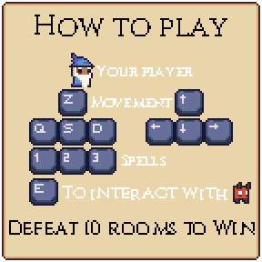

# Slime Slaughter

    

- 2 spells are unlocked by completing quests and you start with one.

# REQUIREMENTS

### MANDATORY

- [X] The player needs to have characteristics
- [X] The player can fight enemies AND the characteristics impact the fights results 
- [X] The player have an inventory which can contain a limited set of items
- [X] The player can earn experience by winning fights and/or accomplishing specific actions
- [X] The player can level up thanks to experience AND upgrading its characteristics
- [X] The game contains NPC
- [X] The game contains at least one quest
- [X] The game contains a how to play system at the very beginning

### TECHNICAL REQUIREMENTS

- [X] A collision system including moving and static elements with different shapes.
- [X] Camera movements (zoom, translation, rotation).
- [X] 3D effects (depth scaling, isometric projection. . . ).
- [X] Buttons must have at least 3 differents state
- [X] Saving system

### MUST

#### General

- [X] The window may be closed using events,
- [X] The windows may have differents mode:
    - [X] Window mode
    - [X] Fullscreen
- [X] The windows may have differents resolutions, at least two (1920x1080, and an other)
- [X] The game manages inputs from the mouse click and keyboard,
- [X] The game contains animated sprites rendered thanks to sprite sheets,
- [X] Animations in your program are frame rate independent,
- [X] Animations and movements in your program are timed by clocks.

#### Main menu

- [x] Must contain at least these options
    - [X] Start the game
    - [X] Resume game (grayed out if not possible)
    - [X] Settings
    - [X] Quit the game
- [X] The settings option must contain
    - [X] Sound and music volume options
    - [X] A window size and resolution options

#### In game menu

- [X] Must be accessible by pressing the Escape key
    - Must contain at least these options
    - [ ] Character options
      - [ ] equipment and inventory management
      - [ ] characteristics management
    - [X] Saving
    - [X] Loading
    - [X] Commands list
    - [X] Settings
      - [X] the same that main menu

### SHOULD

- [X] Splash screen at the beginning
- [ ] Command edit into the in game menu
- [X] As much information as possible about the game should be stored in a configuration file.
- [ ] The game should have an advanced collision system to manage complex fighting.
- [ ] The game should contain simple particle system:
    - [ ] with at least 2 types of particle,
    - [ ] particle effects (changing colors, scaling, bouncing, fading) to simulate realistic environment (wind, fire, rain, snow. . . ).

### COULD

- [ ] Have a skill tree, unlocking different abilities (active and passive).
- [ ] Have a complete particle engine.
- [ ] Use scripting to describe entities.
- [ ] Have a map editor.

## Credits

- Main menu background: [AlbertoV](https://www.deviantart.com/albertov)
- Game background: [Kruggsmash](https://www.deviantart.com/kruggsmash)
- Dungeon tileset: [0x72](https://0x72.itch.io)
- Button gui: [Mounir Tohami](https://mounirtohami.itch.io/)
- Fireball: [Xyezwar](https://xyezawr.itch.io/)
- Font: [Natanael Gama](https://fonts.google.com/specimen/Cinzel)
- Music (Only the Braves): [Fitfysounds](https://www.fiftysounds.com)
- Ladder Sound: [Joseph SARDIN](https://bigsoundbank.com/)
- Computer Button: [Greatdocbrown](https://greatdocbrown.itch.io/)
- Slime: [Tienlev](https://tienlev.itch.io/slime-pixel-set)
